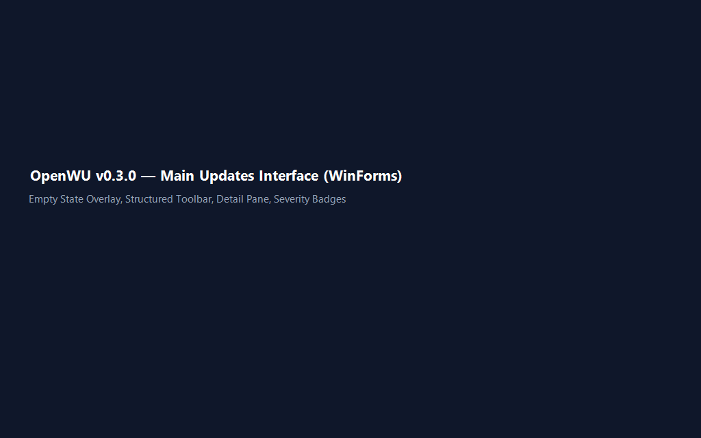
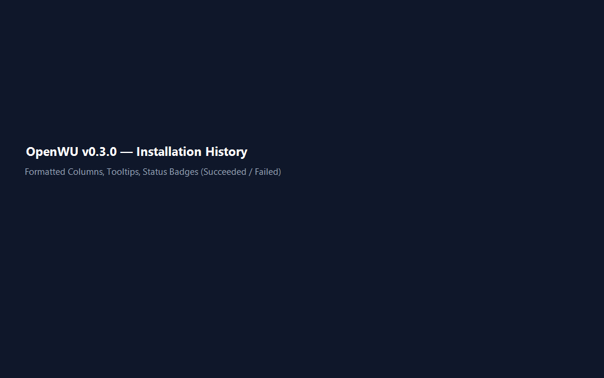
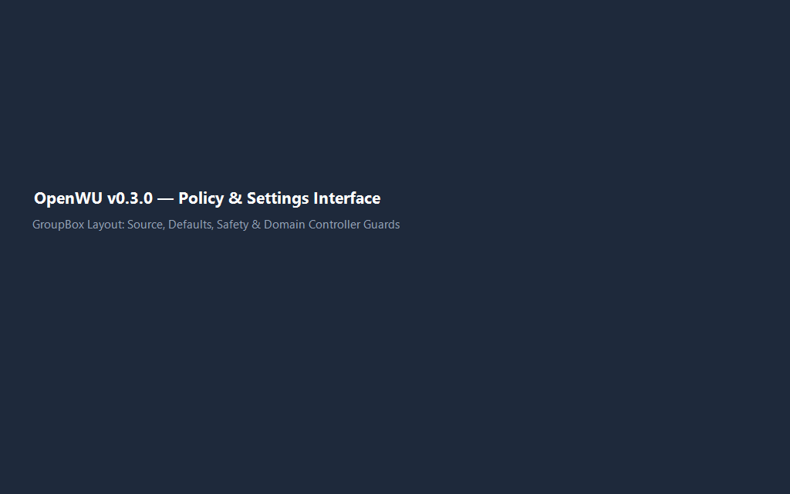
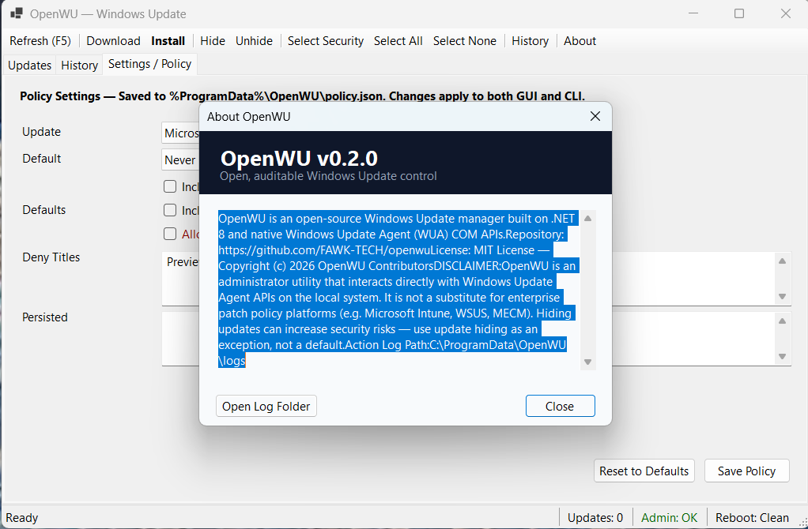

# OpenWU — Universal Windows Update Manager (GUI + CLI)

<p align="center">
  
</p>

> Open, auditable Windows Update control — GUI like WUMT, engine you can trust.

OpenWU is a general-purpose, open-source Windows Update management tool built on **.NET 8** and native Windows Update Agent (WUA) COM APIs. It provides a classic desktop GUI (WinForms) for interactive update management alongside a separate, lightweight CLI executable (`openwu-cli.exe`) with `--json` support for enterprise automation.

---

## Interface

| Updates | History |
|:-------:|:-------:|
|  |  |

| Settings / Policy | About |
|:-----------------:|:-----:|
|  |  |

---

## 🚀 Getting Started (GUI First)

**Double-click `OpenWU.exe`** (or launch from elevated terminal):

```cmd
OpenWU.exe
```

The graphical user interface opens with full administrator rights (via UAC manifest):

1. Click **Refresh (F5)** to scan for pending Windows Updates.
2. Use **Select Security** or **Select All** to check updates.
3. Double-click any row (or inspect the detail pane) to view full KB details, release descriptions, and support URLs.
4. Click **Install** or **Hide** to manage updates safely.
5. Click **About** to inspect version details, license information, disclaimers, and log file paths.

---

## 💻 CLI Automation Mode (`openwu-cli.exe`)

For headless automation, remote management, and RMM scripts, use `openwu-cli.exe`:

```cmd
# Test WUA session health & elevation status
openwu-cli.exe test --json

# List pending updates as JSON
openwu-cli.exe list --json

# Perform a WhatIf simulation for security updates
openwu-cli.exe install --security-only --whatif --json

# Silently install security updates and reboot if required
openwu-cli.exe install --security-only --reboot --json

# Hide specific KB articles and persist to policy
openwu-cli.exe hide --kb KB5031234 --persist

# View update history
openwu-cli.exe history --last 20 --json
```

---

## 🛡️ Safety, Policy & Logging

- **Central Policy Store**: Standardized configuration saved at `%ProgramData%\OpenWU\policy.json`.
- **Action Log**: Real hide, unhide, and install actions are recorded to audit logs at `%ProgramData%\OpenWU\logs\actions-YYYYMMDD.log`.
- **Domain Controller Protection**: Blocks installation on Active Directory DCs unless explicitly allowed via policy or `--allow-domain-controller`.
- **Title Denial Filters**: Soft-denies updates containing keywords like `"Preview"` to prevent unstable builds from installing automatically.
- **Safe Defaults**: Drivers and optional updates are excluded by default.

---

## 📦 Download & Verification

Official release binaries are published on GitHub Releases:
- **Repository**: [https://github.com/FAWK-TECH/openwu](https://github.com/FAWK-TECH/openwu)
- **Release Checksums**: Verify downloaded binaries against `SHA256SUMS.txt`:

```powershell
Get-FileHash OpenWU.exe,openwu-cli.exe -Algorithm SHA256
```

---

## 🏗️ Architecture & Building from Source

```
OpenWu.Core          WUA COM engine, policy store, guards, ActionLog
OpenWu.CliLib        CliHost & JSON automation envelope (no WinForms link)
OpenWu.App           WinForms GUI (OpenWU.exe - no console window)
OpenWu.Cli           CLI host executable (openwu-cli.exe)
OpenWu.Core.Tests    xUnit test suite
```

### Prerequisites
- .NET 8.0 SDK

### Build & Test
```powershell
dotnet build OpenWu.sln
dotnet test OpenWu.sln
```

### Publish Executables
```powershell
.\scripts\publish.ps1
```
Output binaries:
- `artifacts/win-x64/OpenWU.exe` (WinForms GUI)
- `artifacts/win-x64/openwu-cli.exe` (CLI Console)

---

## 📄 Documentation

- [Comparison & Prior Art](docs/COMPARISON.md)
- [Policy Specification](docs/POLICY.md)
- [CLI & Remoting Guide](docs/REMOTING.md)
- [GUI Specification](docs/GUI.md)
- [Code Signing Guide](docs/SIGNING.md)
- [ROADMAP 0.2](docs/ROADMAP-0.2.md)

---

## 📜 License

MIT License — Copyright (c) 2026 OpenWU Contributors
